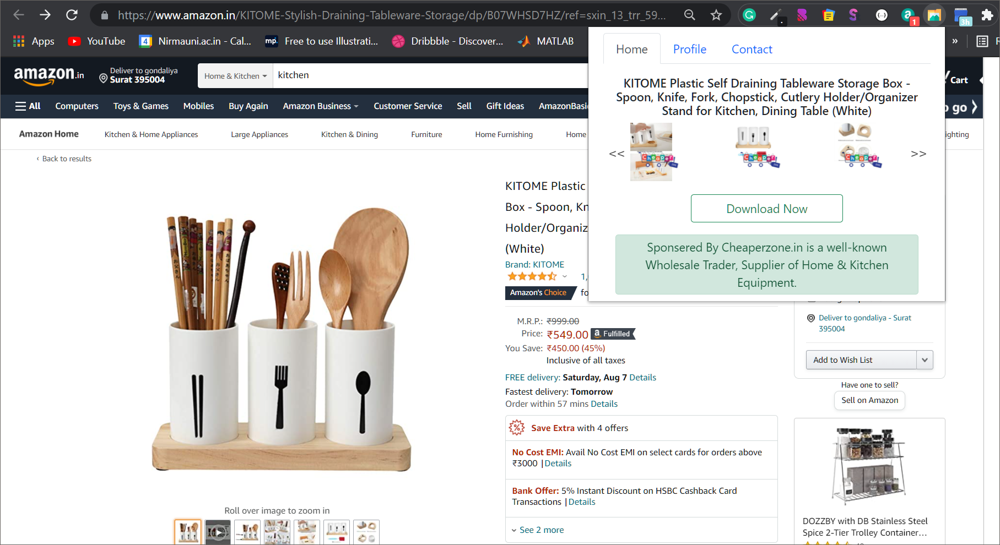
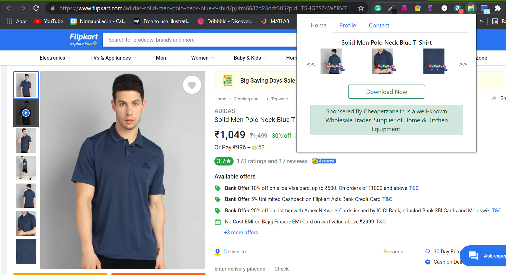
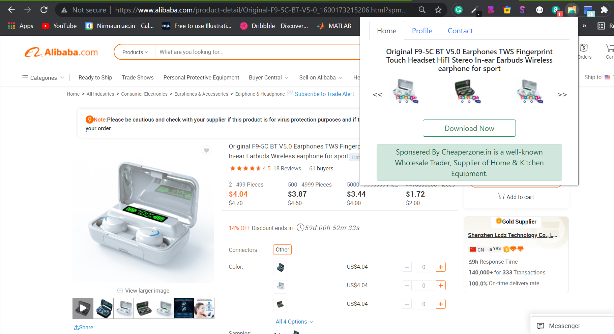
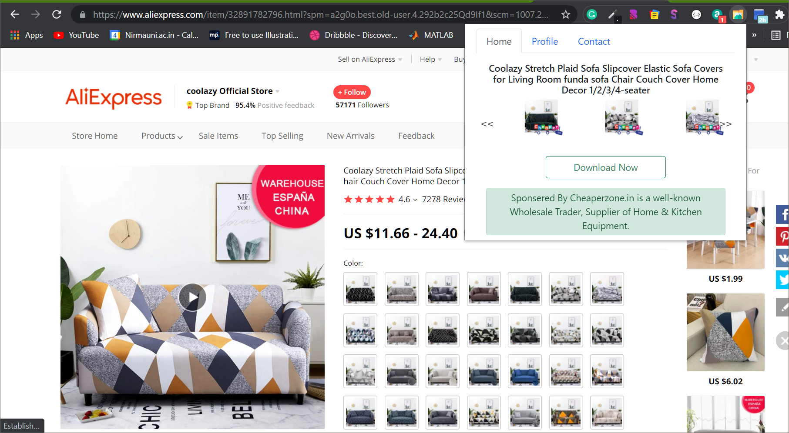
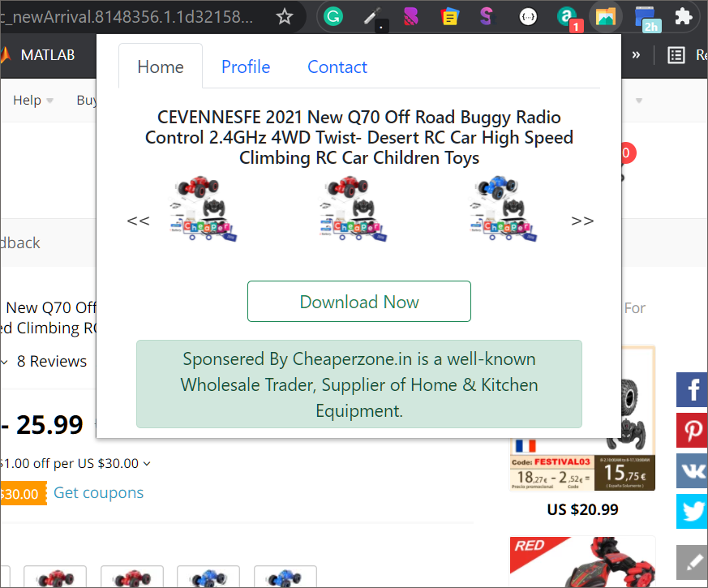
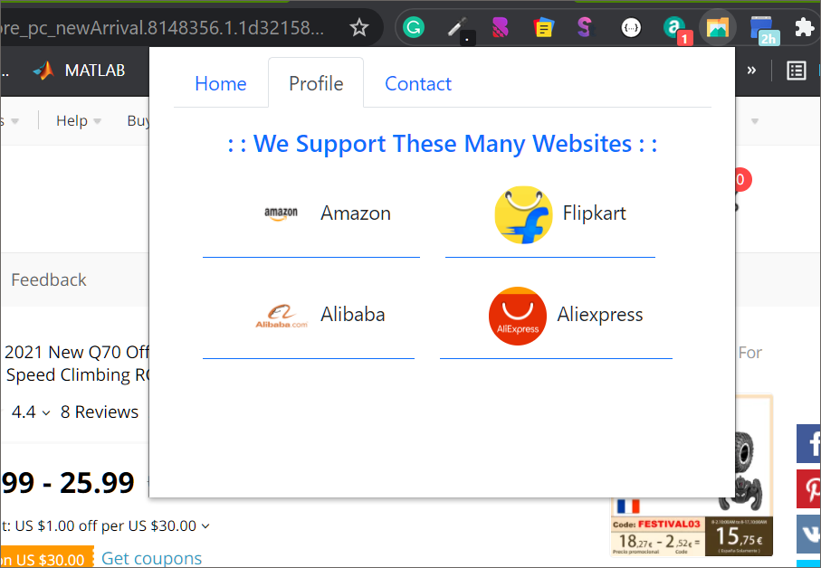
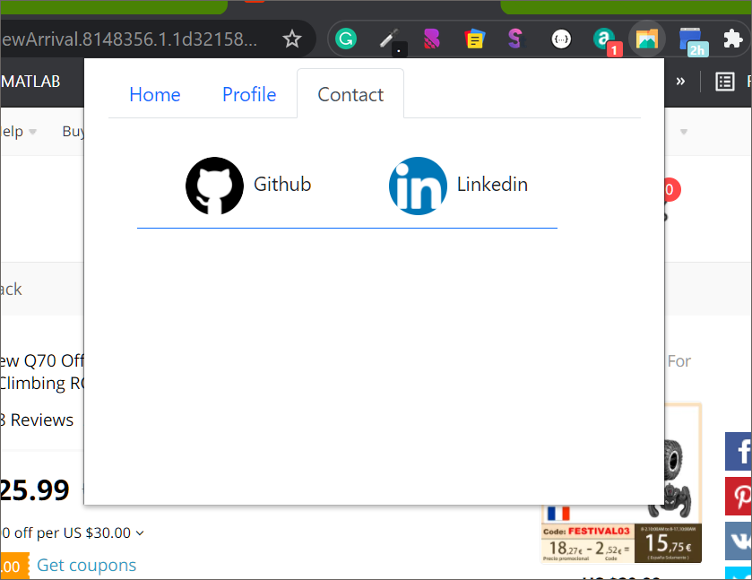
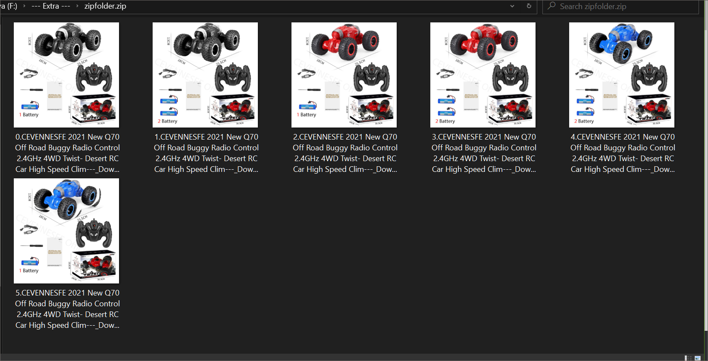

# Chrome-extension For Downloading E-commerce Product Images

## How to Use it:

---

1. first you have to install chrome extention from google web store.
2. Go any of the E-commerce website which is mention here [Supported website list](#supported-on)
3. Go to the Product Page
4. Once the Product Page `Completely loaded` then click to the extention icon.
5. Click on the `Download Now `buttton and download the .zip file.

## Supported On :

---

chrome-extension for downloading images from

> [Amazon](https://www.amazon.in)

> [Flipkart](https://www.flipkart.com)

> [Alibaba](https://www.alibaba.com)

> [AliExpress](https://www.aliExpress.com)

## Screen Shots :

---

`Amazon`
  

---

`Flipkart`
  

---

`Alibaba`
  

---

`AliExpress`
  

---

`Main Section From Where you can download the Images`
  

---

`Info Section`
  

---

`Contact Us any time`
  

---

`Product Images are download Successfully`
  

